# Stream Sentinel, Explained in Plain Terms

This is the "explain it like I mean it" guide to how Stream Sentinel works. It
assumes no prior knowledge of streaming systems or machine learning, but it
doesn't skip the real details — every concept is named, every important file is
pointed to, and the actual numbers are here. If you read this top to bottom,
you'll understand not just *what* the system does but *why* each piece exists
and *how* they hand work to each other.

> **What is Stream Sentinel?** It watches a stream of credit-card-style
> transactions as they happen and decides, in about a third of a millisecond
> each, whether each one looks fraudulent. When something looks bad it raises an
> alarm, can automatically block the customer, and files the record away for
> analysis. It also keeps an eye on its own accuracy and can retrain and
> redeploy its decision model **without ever shutting down**.

> [!NOTE]
> **How to read this document.** The main text is plain-language and assumes
> nothing. Scattered throughout are collapsible **"Optional deep dive"** boxes —
> click any one to expand it. Those boxes are more technical and include real
> code from the codebase. They are entirely skippable: read only the main text
> and you'll still understand the whole system. Expand the boxes when you want
> to see exactly how a piece is implemented.

---

## Table of contents

1. [The big idea: a conveyor belt, not a phone tree](#1-the-big-idea-a-conveyor-belt-not-a-phone-tree)
2. [Where the transactions come from (the producer)](#2-where-the-transactions-come-from-the-producer)
3. [The decision-maker (the fraud detector)](#3-the-decision-maker-the-fraud-detector)
4. [The brains behind the model (the ML subsystem)](#4-the-brains-behind-the-model-the-ml-subsystem)
5. [The model library and the deployment controls](#5-the-model-library-and-the-deployment-controls)
6. [How it watches its own health and retrains itself](#6-how-it-watches-its-own-health-and-retrains-itself)
7. [The plumbing that ties it together](#7-the-plumbing-that-ties-it-together)
8. [Testing and running it for real](#8-testing-and-running-it-for-real)
9. [The whole thing in one breath](#9-the-whole-thing-in-one-breath)
10. [Glossary](#glossary)

---

## 1. The big idea: a conveyor belt, not a phone tree

The whole system is organized around **Kafka**, which you can picture as a set
of conveyor belts in a factory. Each worker (component) picks up a piece of work
from one belt, does its job, and drops the result onto another belt. No worker
ever taps another on the shoulder and waits for an answer. They only ever talk
*through the belts*.

In Kafka's own vocabulary, a belt is called a **topic**, the workers reading
from it are **consumers**, and the workers putting things on it are
**producers**.

Why build it this way instead of having components call each other directly?

- **You can add more workers instantly.** The main input belt is split into 12
  parallel lanes (Kafka calls them **partitions**), so up to 12 copies of the
  fraud checker can run at once, each handling its own lane. Need more
  throughput? Add workers.
- **One slow part doesn't freeze the rest.** If the database is having a bad
  day, transactions keep getting scored — the results just queue up on a belt,
  waiting to be saved, instead of jamming the whole line.
- **Failure has a designated place to go.** Anything unprocessable is dropped
  onto a special "failure belt" rather than crashing the worker that found it.

Here's the entire system as belts and workers. Read it left to right, top to
bottom:

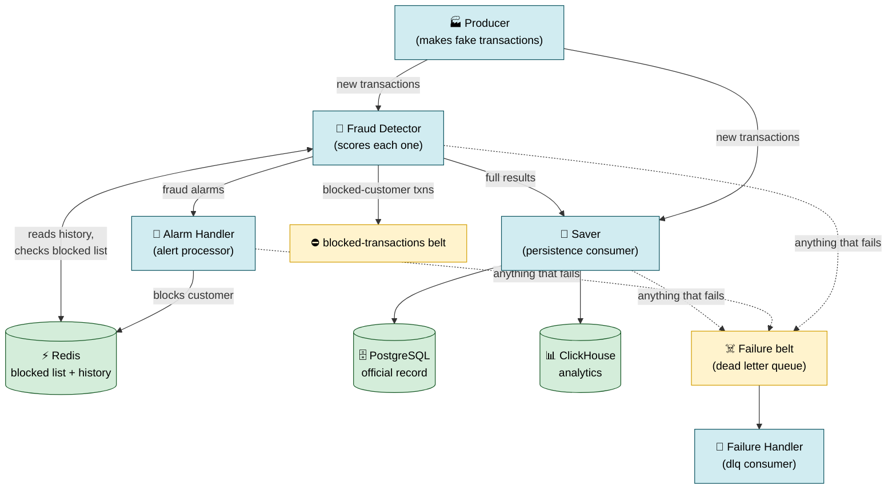

The dotted lines are the "something went wrong" paths. The solid lines are the
normal flow of work. Notice that **nothing points back to the producer** — work
only ever flows forward, which is what makes the whole thing easy to scale and
reason about.

> **A note on the names.** Throughout this doc, "belt" = Kafka topic, "worker" =
> a consumer/producer process, and the actual topic names are things like
> `synthetic-transactions`, `fraud-alerts`, `fraud-detection-results`,
> `blocked-transactions`, `model-drift-alerts`, `model-retraining-jobs`, and
> `dead-letter-queue`.

<details>
<summary><strong>🔬 Optional deep dive — How the belts are actually configured</strong> (click to expand)</summary>

<br/>

All the belt settings live in one place, `src/kafka/config.py`, which is
**environment-aware**: the same code behaves differently on a laptop
(`development`) versus in production. A single `KafkaConfig` class hands out
tuned settings depending on what kind of worker is asking.

The key insight in the producer config is that it deliberately trades a tiny bit
of latency for a lot of throughput — it waits up to 50 milliseconds to *batch
up* many transactions into one compressed network send, rather than firing each
one off individually:

```python
# src/kafka/config.py — get_producer_config(), the "transaction" profile
# Transactions are small and high-volume, so the right trade-off is
# bigger batches / more compression.
{
    "linger.ms": 50,                 # wait up to 50ms to fill a batch
    "batch.size": 1_048_576,         # 1 MiB per-partition batch buffer
    "compression.type": "lz4",       # fast compression, high ratio
}
```

In production, durability settings get stricter — the producer waits for *all*
replicas to acknowledge a write before considering it done:

```python
# production overrides
{"acks": "all"}   # maximum durability; vs "acks": "1" in development
```

**Why 12 partitions matters.** A Kafka topic is split into partitions, and each
partition can be read by exactly one consumer *within a consumer group*. With 12
partitions on `synthetic-transactions`, up to 12 fraud-detector copies can read
in parallel — partition 13 onward would just sit idle. This is the mechanism
behind "add more workers to go faster": Kafka automatically reassigns partitions
across the consumers in a group as they join and leave (a "rebalance").

Consumers commit their progress (their "offset") manually after successfully
handling a message, which is what lets a crashed worker resume exactly where it
left off rather than dropping or double-counting transactions.

</details>

---

## 2. Where the transactions come from (the producer)

**File:** `src/producers/synthetic_transaction_producer.py` (class
`SyntheticTransactionProducer`)
**Settings:** `src/producers/config.py`

There's no real bank feed wired into this project, so the first worker on the
line *manufactures* transactions to test everything against. The trick is making
fake data that behaves like real fraud — otherwise the fraud detector would be
learning to catch patterns that don't exist in the wild.

It does three things to stay realistic:

**1. It copies the statistical fingerprint of a real dataset.** Each transaction
has about **200 fields**, matching the distributions of the well-known public
IEEE-CIS fraud dataset: amounts, card details, counts of how many cards and
addresses an account has touched, time gaps since the account's last activity,
and device/email signals. The real-world distributions are loaded from
`data/processed/ieee_cis_analysis.json`.

**2. Fraud is correlated, not random.** This is the most important detail. A
naive generator would flip a coin and label some transactions "fraud" at random.
Real fraud doesn't work that way — a fraudulent transaction tends to be
suspicious in *several ways at once*. So the generator first decides whether a
transaction is fraud based on genuine risk factors (`_determine_if_fraud` — odd
hour, unusual amount, rapid-fire spending), and then deliberately makes the
fraudulent ones *look* suspicious in a coordinated way
(`_apply_fraud_correlations` — a big amount **and** an unusual time **and** high
velocity, together). The baseline fraud rate is **2.71%** (`BASE_FRAUD_RATE`),
matching the real dataset.

**3. It remembers each customer.** An `entity_tracking` dictionary keeps the last
time it saw each fake customer, card, device, and email, so the "time since last
transaction" fields are internally consistent rather than nonsense.

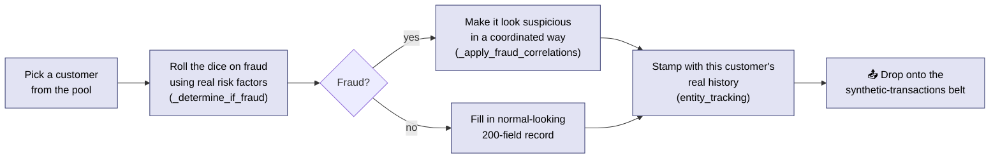

Every knob lives in one file (`src/producers/config.py`): the fraud rate, how
much each risk factor matters, how often fields are left blank, the target speed
(`DEFAULT_TARGET_TPS = 2000`), the size of the customer pool
(`DEFAULT_USER_COUNT = 5000`). One worker can generate ~1,800 transactions per
second; four workers running together exceed 7,500 per second.

<details>
<summary><strong>🔬 Optional deep dive — Why "correlated" fraud is the whole point</strong> (click to expand)</summary>

<br/>

The reason this matters is subtle but important for anyone evaluating the ML
side. If fraud labels were assigned *independently* of the feature values, then
no model — however sophisticated — could ever learn to predict them, because
there'd be no signal to learn. The synthetic generator avoids this by making
fraud a *consequence* of risk factors, then amplifying the tell-tale signs.

The decision happens in two stages. First, a probability is computed from
multiple multipliers (the actual values live in `src/producers/config.py`):

- **Temporal** — transactions at unusual hours are more likely fraud
  (`TEMPORAL_FRAUD_MULTIPLIERS`).
- **Amount** — unusually large amounts raise the odds.
- **Velocity** — many transactions in a short window raise the odds.
- **Risk** — risky merchant categories / email domains / devices raise the odds.

Then, *if* a transaction is rolled as fraud, `_apply_fraud_correlations` nudges
its feature values so the anomalies show up *together* — a fraudulent record
won't just have a high amount, it'll tend to *also* have an odd hour and high
velocity. This co-occurrence is exactly the structure a tree-based model like
XGBoost is good at carving up.

The `entity_tracking` dictionary is what keeps the time-delta features
("D-features" in IEEE-CIS terms) honest. Each fake customer, card, device, and
email has its last-seen timestamp recorded, so when the same entity transacts
again, the "seconds since this card was last used" value is real rather than a
random number. Without this, a model could "cheat" by learning artifacts of the
generator instead of realistic behavior.

</details>

---

## 3. The decision-maker (the fraud detector)

**File:** `src/consumers/fraud_detector.py` (~2,300 lines, class `FraudDetector`)

This is the centerpiece. For each transaction it runs a short, fixed checklist
inside the `process_transaction` method. Here is that checklist as the
transaction experiences it:

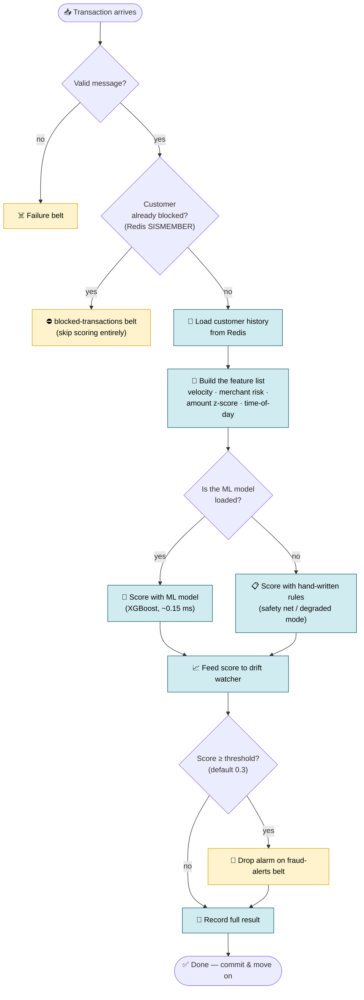

Walking through the steps:

1. **Sanity-check the message** (`src/validation/transaction_validator.py`).
   Malformed transactions are thrown onto the failure belt *before* any work is
   wasted on them.
2. **Is this customer already blocked?** It checks a "blocked list" kept in
   **Redis** — an in-memory data store, essentially a very fast shared
   scratchpad. The check is a single `SISMEMBER blocked_users` operation. If the
   customer is blocked, the transaction skips scoring entirely and goes to the
   blocked belt. No point scoring someone you've already shut off.
3. **Pull up the customer's history** from Redis (their typical spending, recent
   activity) via `get_user_profile`.
4. **Build the feature list** (`extract_features`). It combines the raw
   transaction with computed signals: how fast this customer is spending
   ("velocity"), how risky this merchant type is, how far this amount is from
   their normal ("z-score" — how many standard deviations from typical),
   time-of-day patterns, and combinations of these.
5. **Score it** (see below).
6. **Feed the score to a drift watcher** (covered in [section 6](#6-how-it-watches-its-own-health-and-retrains-itself)).
7. **Act.** If the score crosses the alarm threshold (**0.3** by default, on a
   0-to-1 scale, tunable with `--threshold`), it drops an alarm on the
   `fraud-alerts` belt. Either way it records the full result on the
   `fraud-detection-results` belt.

<details>
<summary><strong>🔬 Optional deep dive — The actual processing pipeline, step by step</strong> (click to expand)</summary>

<br/>

Here's the real `process_transaction` method, lightly trimmed. Notice the
ordering is deliberate: the blocked-user check comes **first** so the system
spends zero compute on customers it has already shut off.

```python
# src/consumers/fraud_detector.py
def process_transaction(self, transaction: Dict[str, Any]) -> None:
    user_id = transaction["card1"]  # card1 doubles as the user identifier

    # ---- Blocking enforcement: check BEFORE scoring ----
    if self._is_user_blocked(user_id):           # Redis SISMEMBER blocked_users
        self.blocked_count += 1
        self._publish_blocked_transaction(transaction, user_id)
        self.processed_count += 1
        return                                     # skip scoring entirely

    # Load behavioral history, then extract features (which also scores)
    user_profile = self.get_user_profile(user_id)
    features = self.extract_features(transaction, user_profile)

    # Feed the fraud score to the drift monitor (non-blocking, best-effort)
    if self.drift_monitor is not None:
        drift_alert = self.drift_monitor.record_score(features.fraud_score)
        if drift_alert is not None:
            self.logger.warning("Drift detected: PSI=%.4f severity=%s",
                                 drift_alert["psi_score"], drift_alert["severity"])

    # Update and persist the customer's running profile
    user_profile.update_daily_stats(features.amount, transaction["generated_timestamp"])
    user_profile.update_transaction_stats(features.amount, transaction["generated_timestamp"])
    self.save_user_profile(user_profile)

    # Publish an alert only if the score crossed the threshold...
    if features.is_fraud_alert:
        self.publish_fraud_alert(features, transaction)
    # ...but always record the full result for persistence/analytics
    self.publish_fraud_detection_result(features, transaction, processing_start_time)
```

A few design choices worth noting:

- **The user profile is read, updated, and written back on every transaction.**
  That running profile (average amount, daily count, last-seen time) is what
  makes velocity and z-score features possible.
- **The drift feed is wrapped in best-effort error handling** — a drift-monitor
  hiccup must never take down scoring, so it's caught and logged at debug level.
- **An alert and a result are different things.** Every transaction produces a
  *result* (for the saver and analytics); only suspicious ones additionally
  produce an *alert* (for the alarm handler). They go to different belts.

</details>

### How the scoring works — and its safety net

The primary scorer is a trained **machine-learning model**. Specifically it's an
**XGBoost** model — a technique that combines hundreds of simple yes/no decision
trees into one strong predictor, where each new tree focuses on the mistakes of
the previous ones. In production it scores about **99.4% accurate** (measured by
"AUC", a 0-to-1 score of how well it separates fraud from non-fraud) across 200
features.

The genuinely clever part is the **safety net**. When the detector starts up
(`_load_ml_model`), it tries to get the model from two places, in order:

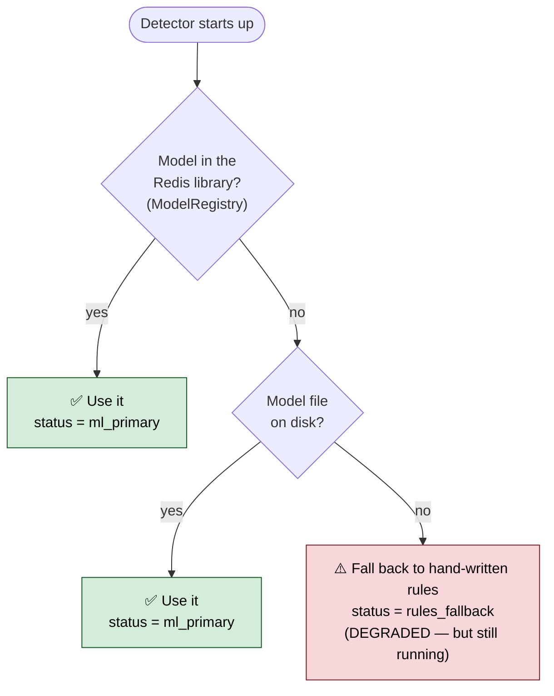

If *both* sources fail, the detector does **not** crash and does **not** go
blind. It flips into a **rules mode** using hand-written "if this looks off, add
to the suspicion score" logic (`_calculate_fraud_score`). An internal status
flag — `model_status` — always reads one of three values: `ml_primary` (using
the ML model), `rules_fallback` (using rules), or `loading`. There is never a
moment where transactions go unscored.

<details>
<summary><strong>🔬 Optional deep dive — The two-tier model load and graceful degradation</strong> (click to expand)</summary>

<br/>

The load order — registry first, filesystem second, rules last — is explicit in
`_load_ml_model`:

```python
# src/consumers/fraud_detector.py — _load_ml_model (condensed)

# --- Attempt 1: ModelRegistry (the Redis-backed model library) ---
if registry is not None:
    registry_model = registry.get_active_model("production")
    if registry_model is not None:
        self.model_version = registry.active_deployments["production"]["version"]
        self._unpack_model_data(registry_model, "registry")
        return

# --- Attempt 2: Filesystem pickle ---
resolved_path = self._resolve_model_path(model_path)
if resolved_path is None:
    self.logger.error("ML model not found -- will use rule-based scoring (DEGRADED)")
    self.use_ml_model = False           # <-- fall through to rules
    return

with open(model_path_str, "rb") as f:
    model_data = pickle.load(f)
# unpack model + scaler + label_encoders + feature_names ...
```

The graceful-degradation path is just as important as the happy path. If ML
inference ever throws an exception *during scoring* (not just at load), the
detector catches it, flips `model_status` to `rules_fallback`, and computes a
rule-based score for that very transaction so nothing is dropped:

```python
# src/consumers/fraud_detector.py — _calculate_ml_fraud_score (the except branch)
except Exception as e:
    self.logger.error(f"ML inference failed: {e} -- switching to rules_fallback mode")
    self.model_status = "rules_fallback"   # subsequent txns skip ML entirely

    # Compute a rule-based score for THIS transaction so it isn't lost
    amount_vs_avg_ratio = amount / user_profile.avg_transaction_amount ...
    is_high_amount      = amount > 1000.0
    is_unusual_hour     = dt.hour < 6 or dt.hour > 22
    is_rapid_transaction = time_since_last < 300
    velocity_score      = user_profile.daily_transaction_count / 24.0
    return self._calculate_fraud_score(amount_vs_avg_ratio, is_high_amount,
                                       is_unusual_hour, is_rapid_transaction,
                                       velocity_score, user_profile.daily_transaction_count)
```

That `model_status` flag isn't just internal bookkeeping — it's published as a
Prometheus gauge, so a dashboard or alert can fire the moment any consumer slips
into degraded mode. (More on that in [section 7](#7-the-plumbing-that-ties-it-together).)

</details>

### Swapping the model without downtime

A background timer thread (`_model_refresh_loop`) wakes up **every 60 seconds**
and checks whether a newer model has been published to the library. If so, it
swaps it in mid-flight: transactions already being scored finish on the old
model; new ones use the new one. No restart, no dropped messages. A lock makes
sure a swap and a scoring never trip over each other.

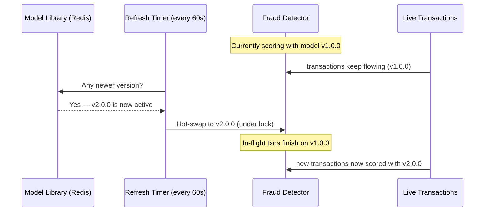

<details>
<summary><strong>🔬 Optional deep dive — How the hot-swap stays thread-safe</strong> (click to expand)</summary>

<br/>

The danger with swapping a model while transactions are being scored is a *data
race*: a scoring thread could read a half-replaced model. The fix is a lock that
makes the swap atomic from the scorer's point of view. The refresh loop only
does real work when the registry's active version differs from the one currently
loaded:

```python
# src/consumers/fraud_detector.py — _check_and_refresh_model (condensed)
deployment = self.model_registry.active_deployments.get("production")
new_version = deployment.get("version", "unknown")
if new_version == self.model_version:
    return                                   # nothing changed — cheap no-op

new_model_data = self.model_registry.get_active_model("production")

# Hot-swap under lock so scoring threads see a consistent state
with self._model_lock:
    old_version = self.model_version
    self._unpack_model_data(new_model_data, "registry")
    self.model_version = new_version
    self.model_status = "ml_primary"

# Update Prometheus so dashboards show the live version flip
prom.current_model_info.labels(model_name="fraud_detector",
                               version=new_version, algorithm="xgboost").set(1.0)
```

The check is intentionally cheap — most of the time the version is unchanged and
the method returns immediately, so the 60-second cadence costs almost nothing.
The lock is only *held* during the actual unpack-and-assign, which is
microseconds, so it doesn't meaningfully stall scoring.

</details>

### Running two models head-to-head (A/B testing)

When you want to test a new model against the current one on *real* traffic, the
detector splits customers into two groups. It does this with a hashing trick
(`ab_test_manager.assign_variant`): it scrambles the customer's ID into a number
(using MD5) and uses that number to assign the group. Because the same ID always
scrambles to the same number, a given customer always lands in the same group —
their experience stays consistent. The "control" group is scored by the current
model; the "treatment" group by the candidate. The system tallies which catches
more fraud, then runs a standard statistics test (a **two-proportion z-test** — a
textbook way to check whether the gap between two rates is real or just luck)
before declaring a winner.

<details>
<summary><strong>🔬 Optional deep dive — Race-free A/B scoring and sticky assignment</strong> (click to expand)</summary>

<br/>

Two implementation details make A/B testing safe and stable.

**1. Assignment is "sticky" via Redis.** The first time a customer is seen during
an experiment, their variant is computed and *stored* with a 24-hour expiry, so
every later transaction from that customer reuses the same assignment:

```python
# src/ml/online_learning/ab_test_manager.py — assign_variant (condensed)
assignment_key = f"assignment:{experiment.experiment_id}:{user_id}"
existing = self.redis_ab_tests.get(assignment_key)
if existing:
    return json.loads(existing)["variant_id"]     # sticky — reuse prior choice

variant_id = self._assign_user_to_variant(user_id, experiment, transaction_context)
self.redis_ab_tests.setex(assignment_key, 86400, json.dumps(asdict(assignment)))
```

**2. The treatment model is scored without touching shared state.** The control
group reuses the loaded production model. The treatment group loads its own
model — but scoring it goes through `_score_with_model`, which is deliberately
*side-effect-free*. It does **not** mutate any instance attributes, precisely so
it can't collide with the background refresh thread from the previous deep dive:

```python
# src/consumers/fraud_detector.py — _score_with_model
def _score_with_model(self, model, scaler, label_encoders, model_features,
                      transaction, user_profile) -> float:
    """Score with a SPECIFIC model. Does NOT mutate instance state —
    avoids a data race with the background model-refresh thread."""
    features = self._extract_ml_features(transaction, user_profile)
    return float(model.predict_proba([features])[0][1])
```

Every prediction is recorded back to the `ABTestManager`
(`record_prediction_result`), which accumulates per-variant counts that later
feed the two-proportion z-test and an early-stopping check.

</details>

### Two speeds

- **Single mode** (default): one transaction at a time. Simple and predictable.
- **Batch mode** (`--batch`): gathers a handful of transactions and scores them
  in one shot, which is more efficient per transaction. A **flow controller**
  watches how far behind the system is and automatically shrinks the batch if
  processing starts lagging, so it never bites off more than it can chew. The
  batch path commits its progress only after the whole batch finishes, which
  keeps the bookkeeping exactly correct even if a single message in the batch
  fails.

### Why it's fast

The heavy number-crunching is offloaded to a small **C++ component** (a compiled,
low-level language that's far faster than Python for math-heavy work). Python
hands off the calculation through `FastInferenceEngine`
(`src/inference/fast_inference.py`) and gets the answer back in about **0.15
milliseconds**. End to end — validation, history lookup, feature building,
scoring, publishing — a transaction takes roughly **0.32 milliseconds**, which
works out to about **3,100 transactions per second per worker**.

The model is converted into the format the C++ piece reads by
`src/inference/export_model.py`, and the C++ source lives in
`src/inference/cpp/`. Importantly, **if the C++ piece isn't built, the system
silently falls back to pure Python** — slower, but fully working. You never *have*
to compile anything to run the project.

<details>
<summary><strong>🔬 Optional deep dive — The three tricks that make scoring fast</strong> (click to expand)</summary>

<br/>

Getting to 0.32 ms per message took eliminating overhead that's invisible until
you profile it. Three precomputation tricks matter most.

**1. The C++ inference path.** When enabled, scoring goes through
`FastInferenceEngine`, which calls into a compiled XGBoost wrapper. The Python
pickle is *still* loaded — it's needed for feature extraction and as a fallback —
but the prediction itself runs in native code:

```python
# src/consumers/fraud_detector.py — _calculate_ml_fraud_score (the fast path)
if hasattr(self, "fast_inference_engine") and self.fast_inference_engine:
    fraud_probability, performance_info = \
        self.fast_inference_engine.predict_fraud_probability(features)
    return float(fraud_probability)
else:
    # Pure-Python fallback. The production pickle stores a bare Booster
    # (no predict_proba), so handle both shapes.
    if hasattr(self.ml_model, "predict_proba"):
        return float(self.ml_model.predict_proba([features])[0][1])
    feat_arr = np.asarray(features, dtype=np.float32).reshape(1, -1)
    return float(self.ml_model.inplace_predict(feat_arr)[0])
```

**2. Categorical encoding via O(1) dict lookup.** A trained model expects
categorical strings (like an email domain) turned into numbers. The standard
scikit-learn `LabelEncoder.transform([value])` call builds a numpy array and runs
a binary search *every single time* — about 100 microseconds per encoder, and
with 31+ encoders that's milliseconds of pure overhead per message. So at model
load time the detector flattens each encoder into a plain Python dict for instant
hash lookups:

```python
# src/consumers/fraud_detector.py — _rebuild_encoder_lookup (the comment says it all)
# sklearn's transform goes through numpy + np.searchsorted per call (~100us each).
# With 31+ encoders that's ~3ms per message of pure encoding overhead.
# Precompute a plain {str_value: float_index} dict once -> O(1) hash lookup.
class_to_index = {str(cls): float(i) for i, cls in enumerate(encoder.classes_)}
```

**3. Scaling via cached numpy arrays.** Similarly, `StandardScaler.transform`
wraps each call in DataFrame checks costing 1–2 ms on a single row. But scaling is
just `(x - mean) / scale` — two vector operations. So the scaler's parameters are
cached once at load time and applied directly, *preserving the training dtype*
(float64) so the fast path matches sklearn bit-for-bit and doesn't silently lose
precision.

There's one more correctness detail in feature assembly: the producer emits
snake_case keys (`transaction_amt`) but the model was trained on the original
IEEE-CIS PascalCase names (`TransactionAmt`). `_extract_ml_features` maps between
them and sets any missing feature to `NaN`, which XGBoost handles natively via its
built-in sparsity support — so a missing field is a *signal*, not a crash.

</details>

### The other workers on the line

| Worker | File | What it does |
|---|---|---|
| **Alarm handler** | `alert_processor.py` | Reads fraud alarms, classifies severity (CRITICAL ≥ 0.9 down to LOW), decides the response (block now, investigate, human review…), and blocks customers by adding them to the Redis blocked list with a 24-hour expiry. Tracks response-time targets (CRITICAL within 1 second). |
| **Saver** | `persistence_consumer.py` | Writes results to two databases: **everything** to ClickHouse (built for fast analytics over huge volumes) and only the **meaningful alerts** to PostgreSQL (the official record). Saves in batches for speed. |
| **Failure handler** | `dlq_consumer.py` | Reads the failure belt ("DLQ" = *dead letter queue*) and logs each failed message with its full error and original contents so a human can investigate. |
| **Enhanced detector** | `enhanced_fraud_detector.py` | An alternate version of the fraud detector that wires the full online-learning stack in directly, for experiments. |

> **Why two databases?** PostgreSQL is the trustworthy system of record — good
> for "show me this specific alert and its audit trail." ClickHouse is built for
> sweeping analytical questions over billions of rows — "what was our fraud rate
> by hour last month?" Using each for what it's best at is why the saver writes
> to both.

<details>
<summary><strong>🔬 Optional deep dive — How the alarm handler enforces blocking and retries</strong> (click to expand)</summary>

<br/>

Blocking is a two-component dance, and Redis is the shared channel between them.
The **alarm handler** decides to block and writes to the set:

```python
# src/consumers/alert_processor.py (condensed)
self.redis.sadd("blocked_users", user_id)   # add to the blocked set
# (set with a 24-hour expiry so blocks aren't permanent by accident)
```

The **fraud detector** enforces it on the customer's *next* transaction, with the
`SISMEMBER` check at the very top of `process_transaction` (shown earlier). So
blocking is eventually-consistent and self-healing: even if the alarm handler is
briefly behind, the next transaction from a flagged customer gets caught.

The alarm handler also has a deliberate **retry-on-failure** behavior. Kafka
consumers advance by committing their offset after handling a message. If the
alarm handler fails to process an alert, it simply *doesn't commit* — so Kafka
redelivers that message on the next poll rather than losing it:

```python
# src/consumers/alert_processor.py — process_alert, on failure
# (no offset commit on the failure path => Kafka redelivers the message)
```

This is the same exactly-once-ish discipline the fraud detector's batch mode
uses: commit only after success.

</details>

---

## 4. The brains behind the model (the ML subsystem)

**Directory:** `src/ml/`

### One feature recipe, used twice

A subtle but critical detail: the *exact same code*
(`src/ml/features/feature_engineer.py`, class `FeatureEngineer`) computes the
signals both when **training** the model and when **scoring live transactions**.

Why this matters: if the training code computed "velocity" one way and the live
code computed it slightly differently, the model would behave differently in the
lab than in production — a notoriously painful bug called **train/serve skew**.
Sharing one module makes it impossible. The same class has a
`compute_batch_features` method (for training, working on a whole table of data)
and a `compute_streaming_features` method (for one live transaction at a time),
both using identical logic underneath.

<details>
<summary><strong>🔬 Optional deep dive — One class, two entry points, identical math</strong> (click to expand)</summary>

<br/>

The class exposes two public methods over the same internal logic and lookup
tables (the merchant-risk table, the hour-risk multipliers, the z-score
formula). Here's the streaming entry point that the live detector calls:

```python
# src/ml/features/feature_engineer.py — compute_streaming_features (condensed)
# 1. Velocity
features["velocity_per_hour"] = daily_count / 24.0 if daily_count > 0 else 0.0
features["velocity_per_day"]  = daily_count

# 2. Merchant risk — same table used in training
features["merchant_risk_score"] = self.config.merchant_risk_table.get(
    product_cd, self.config.default_merchant_risk)

# 3. Amount anomaly (z-score), with a graceful fallback when std isn't tracked
if amt_std > 0:
    features["amount_zscore"] = (amount - avg_amt) / amt_std
elif avg_amt > 0 and total_txns >= 2:
    features["amount_zscore"] = (amount - avg_amt) / (avg_amt * 0.5)  # estimate
else:
    features["amount_zscore"] = 0.0

# 4. Temporal + 5. Interaction features
features["amount_x_hour_risk"] = amount * self.config.hour_risk_multipliers.get(hour, 1.0)
features["velocity_x_amount_deviation"] = (
    features["velocity_per_hour"] * abs(features["amount_zscore"]))
```

The batch entry point, `compute_batch_features(df)`, applies the *same*
operations across a whole pandas DataFrame during training. Because both call
into the same configuration and formulas, a velocity computed in training is
guaranteed to match a velocity computed in production for identical inputs —
which is the entire point.

</details>

### Training the model

**File:** `src/ml/training/core/pipeline_orchestrator.py` (class
`PipelineOrchestrator`)

Training runs as a series of stages, like a pipeline:

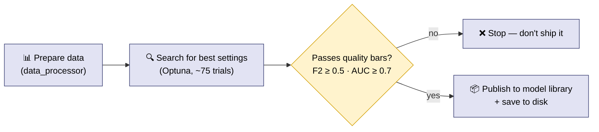

Two things are worth calling out:

**It tunes itself.** Rather than a human hand-picking the model's settings, it
uses a library called **Optuna** to automatically try dozens of configurations
(around 75 trials) and keep the best one. Each trial is checkpointed the moment
it finishes, so a crash mid-search doesn't throw away completed work.

**It's tuned to catch fraud, even at the cost of some false alarms.** The model
is optimized for an **F2-score with cost-sensitive learning** rather than raw
accuracy. In plain terms: missing a real fraud is far more expensive than
occasionally flagging a legitimate transaction, so the training deliberately
rewards *catching more fraud* (recall) more than it rewards *avoiding false
alarms* (precision). The "cost-sensitive" part means it weights the rare fraud
examples much more heavily during training (roughly 36×), because fraud is only
2.71% of the data and would otherwise be drowned out.

The whole pipeline is also **resumable** — if a long training run crashes, a
checkpoint manager lets it pick up where it left off instead of starting over.

<details>
<summary><strong>🔬 Optional deep dive — F2, scale_pos_weight, and why 35.8</strong> (click to expand)</summary>

<br/>

The configuration spells out the reasoning directly:

```python
# src/ml/training/config/training_config.py
# Optimization metric: 'f2' (F-beta with beta=2, recall-weighted) or 'roc_auc'.
# F2-score is the industry standard for fraud detection because missing fraud
# (false negatives) is far more costly than false alarms (false positives).
optimization_metric: str = "f2"

# Cost-sensitive learning via scale_pos_weight.
# Compensates for class imbalance by weighting the positive (fraud) class.
# The theoretical optimum for a 2.71% fraud rate is ~35.8 (neg/pos ratio).
scale_pos_weight_min: float = 1.0
scale_pos_weight_max: float = 40.0
```

**Where 35.8 comes from.** If fraud is 2.71% of transactions, then for every
fraud there are about `(1 - 0.0271) / 0.0271 ≈ 35.8` non-fraud examples. Setting
XGBoost's `scale_pos_weight` near that ratio tells the model "treat each fraud as
if it were worth ~36 ordinary examples," counteracting the imbalance that would
otherwise make it lazily predict "not fraud" for everything and still be 97%
accurate. The Optuna search explores the range 1.0–40.0 to find the best value
empirically rather than just assuming the theoretical optimum.

**Why F2 and not plain accuracy.** F-beta scores blend precision and recall;
beta=2 weights recall (catching fraud) about four times as heavily as precision
(avoiding false alarms). That matches the business reality where a missed fraud
costs far more than a manual review of a false alarm.

**Crash-safe search.** Each Optuna trial saves a checkpoint the instant it
finishes training — before moving on — so an interrupted multi-hour run never
loses completed trials:

```python
# src/ml/training/core/hyperparameter_optimizer.py — ModelObjective.__call__ (condensed)
cv_scores, model = self._train_with_cv(params, trial)        # StratifiedKFold CV
checkpoint = ModelCheckpoint(trial_number=trial.number, parameters=params,
                             score=np.mean(cv_scores), model=model, ...)
checkpoint_id = self.checkpoint_manager.save_checkpoint(checkpoint)  # immediate persist
```

The validation gate that decides whether a trained model is even allowed to ship
reads straight from this config — `F2 ≥ 0.5` (or `AUC ≥ 0.7` if you switch the
metric) in `pipeline_orchestrator.py`.

</details>

---

## 5. The model library and the deployment controls

**File:** `src/ml/online_learning/model_registry.py` (class `ModelRegistry`)

The **model registry** is a versioned library of models stored in Redis (with a
backup copy on disk). Think of it like a package registry, but for trained
models. It:

- tracks which version is currently **live** in production,
- refuses to promote a model that fails a minimum-accuracy bar,
- can **roll back** to a previous version if a new one misbehaves.

`scripts/deploy_model.py` is the command-line control panel for it:

```bash
python scripts/deploy_model.py register --model-path models/new.pkl --version 2.0.0
python scripts/deploy_model.py promote  --version 2.0.0 --strategy canary
python scripts/deploy_model.py rollback --version 1.0.0
python scripts/deploy_model.py ab-test  --control 1.0.0 --treatment 2.0.0
python scripts/deploy_model.py status
```

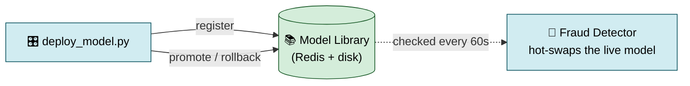

Because the detector re-checks the library every 60 seconds (the hot-swap from
[section 3](#3-the-decision-maker-the-fraud-detector)), **every one of these
commands takes effect without restarting anything.** "Canary" promotion means
rolling the new model out gradually rather than all at once, so you can watch for
trouble before committing fully.

<details>
<summary><strong>🔬 Optional deep dive — Register, then deploy: two separate gates</strong> (click to expand)</summary>

<br/>

The registry deliberately separates *registering* a model (putting it in the
library) from *deploying* it (making it live). Each step validates.

**Registering** assigns a version (auto-incrementing if you don't specify one),
stores the model artifact in Redis with a filesystem backup, and records
metadata:

```python
# src/ml/online_learning/model_registry.py — register_model (condensed)
if not self._validate_model_metadata(metadata):
    return False
if not metadata.version:
    metadata.version = self._generate_next_version(metadata.model_id, metadata.training_trigger)
model_artifact = self._store_model_artifact(model, metadata)   # Redis + disk backup
self.registered_models[metadata.model_id] = metadata
self._save_registry_state()
self._publish_model_event("model_registered", metadata)
```

**Deploying** runs a pre-deployment readiness check (including the minimum-AUC
gate for production), then atomically updates the `active_deployments` record
that the fraud detector's refresh loop reads:

```python
# src/ml/online_learning/model_registry.py — deploy_model (condensed)
if not self._validate_deployment_readiness(metadata, environment):
    deployment.deployment_status = "failed"
    return False
success = self._execute_deployment(model, metadata, environment, traffic_percentage)
if success:
    self.active_deployments[environment] = {
        "model_id":  model_id,
        "version":   metadata.version,
        "deployed_at": metadata.deployed_at,
        "traffic_percentage": traffic_percentage,
    }
```

That `active_deployments[environment]["version"]` field is exactly what
`_check_and_refresh_model` compares against on its 60-second cycle — closing the
loop between "an operator promoted a model" and "every running detector is now
using it," with no restart and no shared deployment script between them.

</details>

---

## 6. How it watches its own health and retrains itself

This is the self-correcting loop, and it's the most sophisticated part of the
system. The danger it guards against is called **drift**: over time, the incoming
traffic can change so much that the model's assumptions no longer hold —
fraudsters change tactics, customer behavior shifts, a new product launches. A
model that was excellent six months ago can quietly become useless.

Here's how the system catches that and fixes itself:

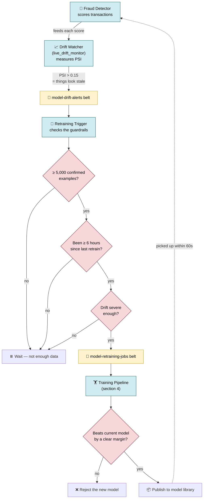

The pieces:

- **Drift watcher** (`src/ml/online_learning/live_drift_monitor.py`). It measures
  drift with **PSI** (Population Stability Index) — a single number summarizing
  how much the distribution of fraud scores has shifted compared to a baseline.
  Above **0.15** is treated as a meaningful warning. It checks periodically (every
  N transactions, default 1,000) rather than on every single one. When it trips,
  it drops a "things look stale" message on the `model-drift-alerts` belt.

- **Retraining trigger** (`src/ml/online_learning/retraining_trigger.py`). It
  listens for those staleness messages but does **not** react blindly. It
  enforces three guardrails first:
  1. **Enough data** — at least 5,000 confirmed-outcome examples to learn from.
  2. **Cooldown** — no more than one retrain every 6 hours, so a noisy signal
     can't trigger a retraining storm.
  3. **Severity** — the drift has to be bad enough to be worth it.

  Only when all three pass does it kick off a retraining job.

- **Quality gate.** A freshly retrained model has to **beat the current one by a
  clear margin** (a measurable AUC improvement) before it's allowed to go live.
  If it doesn't, it's rejected and the old model stays.

So the full cycle is: model gets stale → drift alarm → guardrails → retrain →
quality check → publish → detector hot-swaps it within 60 seconds. It's hands-off,
but with brakes at every step so it can't do something reckless on its own.

<details>
<summary><strong>🔬 Optional deep dive — What PSI actually computes</strong> (click to expand)</summary>

<br/>

PSI compares two distributions — a frozen "baseline" of fraud scores against the
current window — by binning both and summing a weighted log-ratio across the
bins. The whole computation is a few lines:

```python
# src/ml/online_learning/live_drift_monitor.py — _compute_psi
@staticmethod
def _compute_psi(baseline: np.ndarray, current: np.ndarray) -> float:
    """Population Stability Index between two normalised probability vectors."""
    eps = 1e-8
    p = np.where(baseline == 0, eps, baseline)   # avoid log(0)
    q = np.where(current  == 0, eps, current)
    return float(np.sum((q - p) * np.log(q / p)))
```

The monitor buffers scores and only runs a check once it has seen
`check_interval` of them (default 1,000), and it needs at least 50 scores to
bother. The *first* window becomes the baseline (calibrated into fixed bin
edges) and is persisted to Redis so it survives restarts:

```python
# src/ml/online_learning/live_drift_monitor.py — _run_drift_check (condensed)
current_hist, _ = np.histogram(current_scores, bins=self._bin_edges)
current_dist = current_hist / current_hist.sum()
psi = self._compute_psi(self._baseline_distribution, current_dist)
if psi > self.config["psi_threshold"]:           # default 0.15
    alert = self._build_alert(psi, current_scores)
    self._publish_alert(alert)                    # -> model-drift-alerts topic
    return alert
```

Severity is bucketed from the PSI value: `≥ 0.5` critical, `≥ 0.25` high,
`≥ 0.15` medium. That severity travels in the alert and influences the retraining
guards downstream.

</details>

<details>
<summary><strong>🔬 Optional deep dive — The three guardrails, in code</strong> (click to expand)</summary>

<br/>

The retraining trigger's `_should_retrain` is essentially three early-return
checks. All three must pass, which is what prevents both premature retraining (on
too little data) and retraining storms (reacting to every blip):

```python
# src/ml/online_learning/retraining_trigger.py — _should_retrain (condensed)
# Guard 1 — minimum labeled samples
if self._labeled_sample_count < self.config.min_labeled_samples:        # e.g. 5000
    return False

# Guard 2 — cooldown period
if self._last_retrain_time is not None:
    if datetime.now() - self._last_retrain_time < timedelta(hours=self.config.cooldown_hours):
        return False                                                    # e.g. 6h

# Guard 3 — severity / PSI threshold
psi = alert.get("psi_score", 0.0)
severity_rank = _SEVERITY_ORDER.get(alert.get("severity", "low"), 0)
min_rank = _SEVERITY_ORDER.get(self.config.min_severity_for_retrain, 1)
if psi < self.config.min_psi_for_retrain and severity_rank < min_rank:
    return False

return True
```

When all three pass, the trigger publishes a job that *carries the quality gate
with it* — the downstream training run is told the current production AUC and the
minimum improvement it must beat, and the labeled-sample counter is reset so the
next retrain again requires fresh evidence:

```python
# src/ml/online_learning/retraining_trigger.py — _publish_retraining_job (condensed)
job = {
    "job_type": "model_retraining",
    "trigger":  "drift_detection",
    "drift_alert": alert,
    "current_production_auc": self._current_production_auc,
    "validation_gate": {"min_auc_improvement": self.config.auc_improvement_threshold},
    "priority": "high" if alert.get("severity") in ("high", "critical") else "medium",
}
self._producer.produce(self.config.retraining_jobs_topic, value=json.dumps(job))
self._last_retrain_time = datetime.now()
self._labeled_sample_count = 0       # require fresh evidence before next retrain
```

</details>

---

## 7. The plumbing that ties it together

These are the supporting utilities. None of them is the star of the show, but the
system wouldn't be production-grade without them.

| Part | File | What it actually does |
|---|---|---|
| **Belt settings** | `kafka/config.py` | One place defining all the conveyor-belt settings, with separate profiles for laptop / staging / production. |
| **Failure packaging** | `kafka/dlq.py` | The helper that wraps a failed message (what broke, where, the full error trace, the original message) and sends it to the failure belt. |
| **Strict format checking** | `kafka/schema_utils.py` | Optional rigid message-format validation (Avro / Schema Registry); if the checker isn't running, it falls back to plain JSON. |
| **Backpressure** | `kafka/lag_monitor.py` | Watches whether workers are falling behind and tells batch mode to slow down. |
| **Databases** | `persistence/` | PostgreSQL code (official record, audit logs) and ClickHouse code (analytics). |
| **Live metrics** | `monitoring/metrics.py` | Publishes live numbers (transactions/sec, score distribution, latency, which model is active) for dashboards to read. |
| **Health checks** | `monitoring/health.py` | Simple "are you alive?" (`/health`) and "are you ready for traffic?" (`/health/ready`) web endpoints that Kubernetes pings. |
| **Request tracing** | `tracing/correlation.py` | Stamps each transaction with a tracking ID that rides along through every belt, so you can trace one transaction's entire journey end to end. |
| **Structured logs** | `utils/logging.py` | Makes every log line a structured record (with the transaction ID, customer ID, correlation ID) instead of loose text, so logs are searchable. |

### How observability fits together

Each worker publishes its live numbers on its own dedicated port. **Prometheus**
(a metrics collector) scrapes those ports on a schedule, and **Grafana** (a
dashboard tool) charts them.

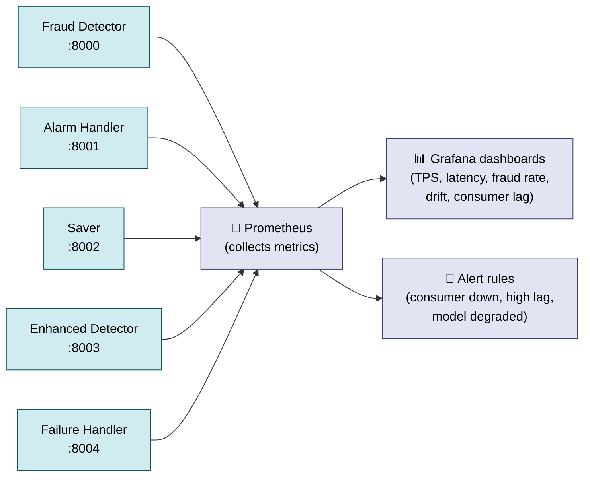

The port assignments are fixed: fraud detector **8000**, alarm handler **8001**,
saver **8002**, enhanced detector **8003**, failure handler **8004**.

<details>
<summary><strong>🔬 Optional deep dive — The failure envelope and end-to-end tracing</strong> (click to expand)</summary>

<br/>

**Nothing is ever silently dropped.** When any worker can't process a message, it
doesn't discard it — it wraps it in an error envelope and publishes it to the
failure belt, so it can be investigated without data loss:

```python
# src/kafka/dlq.py — usage
dlq = get_dlq_publisher()
dlq.publish(
    failed_value=raw_bytes,                 # the original message
    error=exception_instance,               # the exception (type + traceback)
    failure_reason="json_decode_error",     # a machine-readable category
    source_topic="synthetic-transactions",  # where it came from
    consumer_group="fraud-detection-group", # who failed on it
)
```

That envelope also bumps a Prometheus counter
(`dlq_messages_total{failure_reason, source_topic, consumer_group}`), so a spike
in failures of a particular kind is immediately visible on a dashboard.

**Following one transaction across every belt.** Because workers talk only
through Kafka, a naive log search can't reconstruct one transaction's journey. So
each message carries a **correlation ID** in its Kafka headers, generated at the
producer and propagated at every hop:

```python
# src/tracing/correlation.py
HEADER_CORRELATION_ID = "X-Correlation-ID"
HEADER_SPAN_ID        = "X-Span-ID"
HEADER_PARENT_SPAN_ID = "X-Parent-Span-ID"

def generate_correlation_id() -> str:
    return f"corr-{uuid.uuid4().hex[:16]}"     # e.g. corr-9f3a1c...
```

The structured logger (`src/utils/logging.py`) automatically injects the active
correlation ID into every JSON log line, so filtering all logs by one
`corr-…` value reconstructs the full path: producer → fraud detector → alarm
handler → saver. This is the difference between "an error happened somewhere" and
"transaction `corr-9f3a1c` failed validation in the saver at 14:02:11."

</details>

<details>
<summary><strong>🔬 Optional deep dive — Validation as the first line of defense</strong> (click to expand)</summary>

<br/>

Before any scoring happens, `TransactionValidator.validate` enforces a schema and
some lightweight business rules — and it's built to finish in under a millisecond
so it doesn't slow the hot path. Hard errors reject the message to the DLQ; soft
issues become non-blocking warnings:

```python
# src/validation/transaction_validator.py — validate (condensed)
self._check_required_fields(transaction, errors)     # must have core fields + a user id
self._check_transaction_amt(transaction, errors)     # amount present, numeric, sane
self._check_timestamp(transaction, errors, warnings)
self._check_transaction_id_type(transaction, errors)

if errors:                                            # hard failure -> reject to DLQ
    return ValidationResult(is_valid=False, ...)

# Soft, non-blocking business rules (duplicates, velocity) run under a lock
with self._lock:
    self._maybe_cleanup(now)
    self._check_duplicate(transaction, warnings, now)
    self._check_velocity(transaction, warnings, now)
return ValidationResult(is_valid=True, ...)
```

The split between *errors* (reject) and *warnings* (annotate but proceed) matters:
a missing amount is unscoreable and must be rejected, but a suspiciously fast
repeat transaction is itself a *fraud signal* — you want to keep it and flag it,
not throw it away.

</details>

---

## 8. Testing and running it for real

### Testing

The tests in `tests/` are organized in layers, from smallest to most realistic:

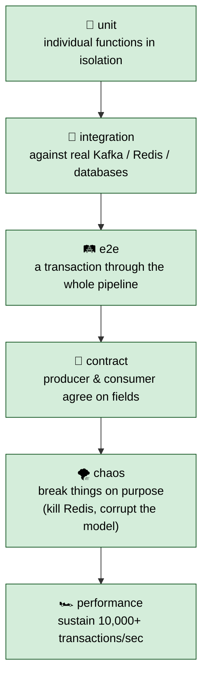

The **chaos** layer is the interesting one: it deliberately breaks dependencies
(kills Redis, corrupts the model file, floods Kafka) to confirm the system
degrades *gracefully* — that the safety nets described above actually fire.
`tests/run_tests.py` runs the whole suite and even spins up the services the
tests need first.

<details>
<summary><strong>🔬 Optional deep dive — Markers, and skipping infrastructure tests</strong> (click to expand)</summary>

<br/>

Tests are tagged with pytest *markers* (defined in `tests/pytest.ini`) so you can
run exactly the slice you want. The ones requiring a live Docker stack are tagged
`requires_infrastructure`, which makes it easy to run a fast, dependency-free
subset on a laptop:

```bash
pytest -m unit                          # just the fast unit tests
pytest -m "kafka"                       # everything touching Kafka
pytest -m "online_learning"             # drift / registry / A-B tests
pytest -m "not requires_infrastructure" # skip anything needing the Docker stack
```

There are also domain markers (`ml`, `redis`, `database`) and category markers
(`integration`, `e2e`, `performance`, `chaos`, `contract`). The orchestrator
`tests/run_tests.py` goes a step further: it health-checks the required services
(Kafka on 9092, Redis on 6379, PostgreSQL on 5432, ClickHouse on 8123) and brings
up `docker-compose.test.yml` before running the categories that need them.

</details>

### Running it locally

Local development uses **Docker** (`docker/`) — one command brings up Kafka,
Redis, both databases, and the monitoring dashboards as containers on your
machine:

```bash
docker compose -f docker/docker-compose.yml up -d
```

### Running it in production

Production uses **Kubernetes** (`k8s/`), the industry-standard system for running
containers across a fleet of servers. The headline feature is **autoscaling**: it
keeps a minimum of **2** fraud-detector copies running and automatically spins up
to **12** when CPU gets busy (above 70%), then scales back down when traffic
calms.

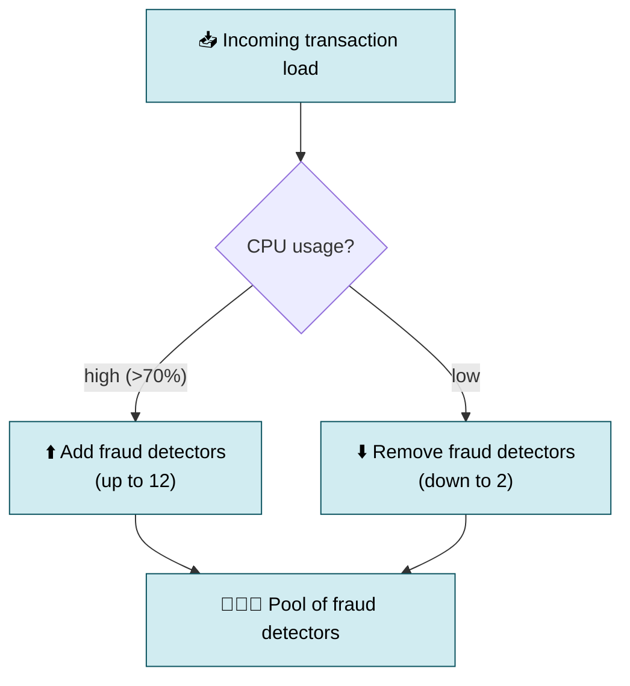

**Helm** (`helm/stream-sentinel/`) is the templating tool that makes all those
settings — image versions, database endpoints, replica counts, the fraud
threshold — configurable from a single `values.yaml` file instead of editing
dozens of manifests by hand. The container image itself is built from
`docker/Dockerfile.consumer`, which compiles the fast C++ component during the
build and runs as a non-root user for security.

<details>
<summary><strong>🔬 Optional deep dive — How autoscaling ties back to partitions</strong> (click to expand)</summary>

<br/>

The autoscaler (a Kubernetes **HorizontalPodAutoscaler**, defined under
`k8s/hpa/`) watches CPU and replica count: `min=2`, `max=12`, target CPU 70% (and
memory 80%), with deliberately asymmetric behavior — scale up quickly (+2 pods per
minute) but scale down slowly (-1 pod every 2 minutes) to avoid thrashing.

Here's the elegant part: the **max of 12 is not a coincidence** — it matches the
12 partitions on `synthetic-transactions` from [section 1](#1-the-big-idea-a-conveyor-belt-not-a-phone-tree).
Because each partition can be read by only one consumer in a group, a 13th
fraud-detector pod would have no partition to read and would sit idle. So the
ceiling is set exactly where adding workers stops helping. Scaling is bounded by
the topic's partition count, and the deployment is configured to respect that.

The same `values.yaml` that sets these bounds also carries the application knobs —
the fraud threshold, the model path, batch settings, drift configuration — so the
entire system's behavior is described in one declarative file per environment.

</details>

---

## 9. The whole thing in one breath

> **Fake-but-realistic transactions ride conveyor belts (Kafka) to a fraud
> checker that scores each one in about a third of a millisecond using a
> machine-learning model — with a rules-based safety net if the model is ever
> missing. Customer history and the blocked list live in a fast in-memory store
> (Redis). Alarms get triaged and can auto-block customers; everything is saved
> to two databases and charted on live dashboards. Meanwhile the system watches
> its own accuracy, and when it drifts, it retrains, quality-checks, and
> hot-swaps in a new model within a minute — no downtime — while autoscaling
> itself up and down on Kubernetes as traffic demands.**

The single most important architectural choice is the conveyor belt itself. Once
you accept that every component only ever reads from a belt and writes to a belt,
everything else follows naturally: you scale by adding workers, you survive
failures by letting work queue, and you can swap out any piece — even the brain
of the system, the model — without stopping the line.

---

## Glossary

| Term | Plain meaning |
|---|---|
| **Kafka** | The set of "conveyor belts" all components communicate through. |
| **Topic** | One conveyor belt (a named stream of messages). |
| **Producer / Consumer** | A worker that puts work on a belt / takes work off a belt. |
| **Partition** | A parallel lane within one belt, enabling multiple workers. |
| **Consumer group** | A set of workers sharing a belt's partitions between them. |
| **Offset / commit** | A worker's bookmark on a belt; committing it after success enables crash-safe resume. |
| **Redis** | A very fast in-memory store used for customer history and the blocked list. |
| **XGBoost** | The machine-learning model — many small decision trees combined into one strong predictor. |
| **Feature** | One input signal the model looks at (amount, velocity, time-of-day, etc.). |
| **AUC** | A 0-to-1 score of how well the model separates fraud from non-fraud (~0.994 here). |
| **F2-score** | An accuracy measure that rewards catching fraud (recall) more than avoiding false alarms. |
| **scale_pos_weight** | An XGBoost setting that up-weights the rare fraud class (~36× here) to counter imbalance. |
| **Train/serve skew** | A bug where training and live code compute features differently; avoided by sharing one module. |
| **Drift / PSI** | How much incoming traffic has changed from the baseline; PSI is the number that measures it. |
| **DLQ** | Dead letter queue — the "failure belt" where unprocessable messages go. |
| **Hot-swap** | Replacing the live model without restarting or dropping transactions. |
| **A/B test** | Running two models on different customer groups to compare them on real traffic. |
| **Correlation ID** | A tracking tag carried in Kafka headers that lets you trace one transaction across every belt. |
| **Prometheus / Grafana** | Tools that collect live metrics and chart them on dashboards. |
| **Kubernetes / Helm** | The system that runs the containers in production / the tool that configures it. |
| **HPA** | HorizontalPodAutoscaler — adds/removes worker copies based on load. |

---

*For the AI-assistant-oriented quick reference, see [`CLAUDE.md`](../CLAUDE.md).
For the original architecture summary, see [`README.md`](../README.md). For
deeper dives on individual subsystems, see the topic guides under
[`docs/`](README.md).*
