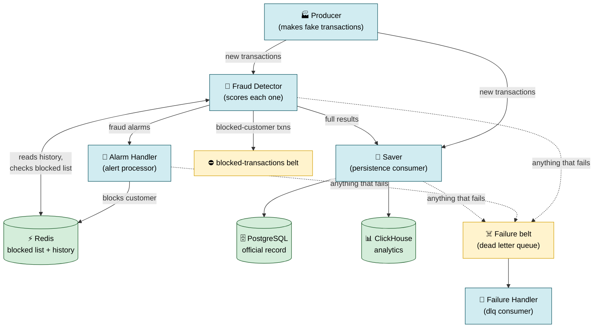
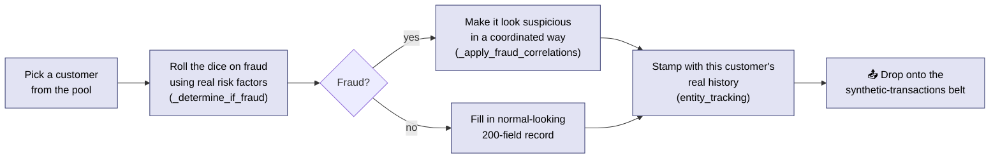
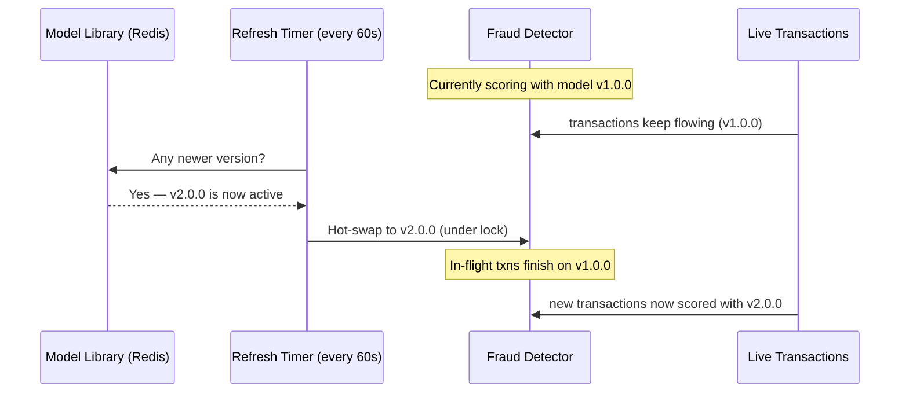
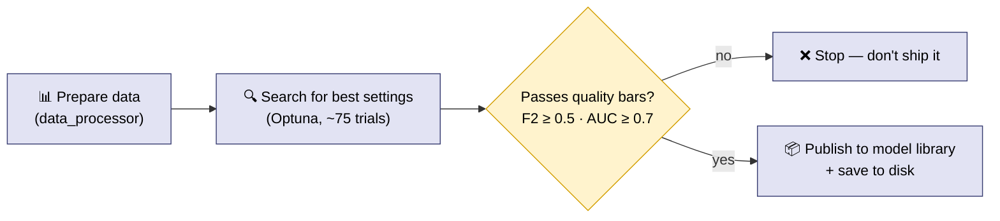
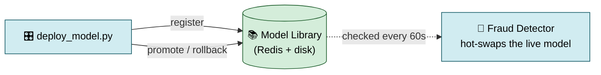
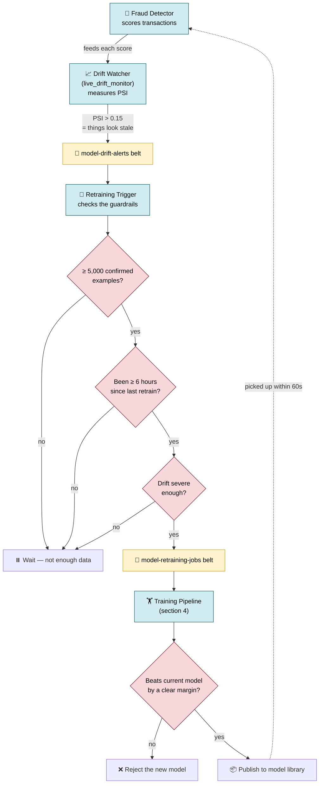
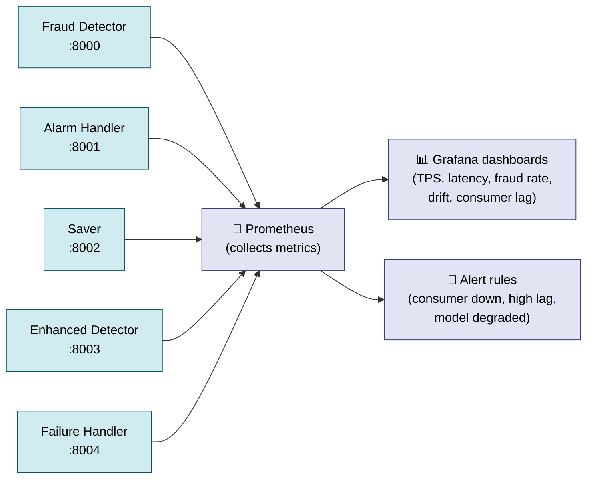
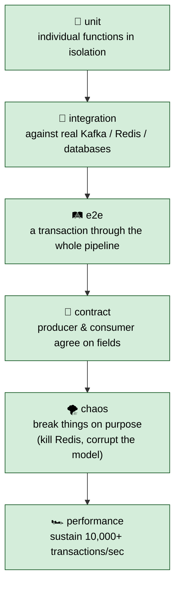
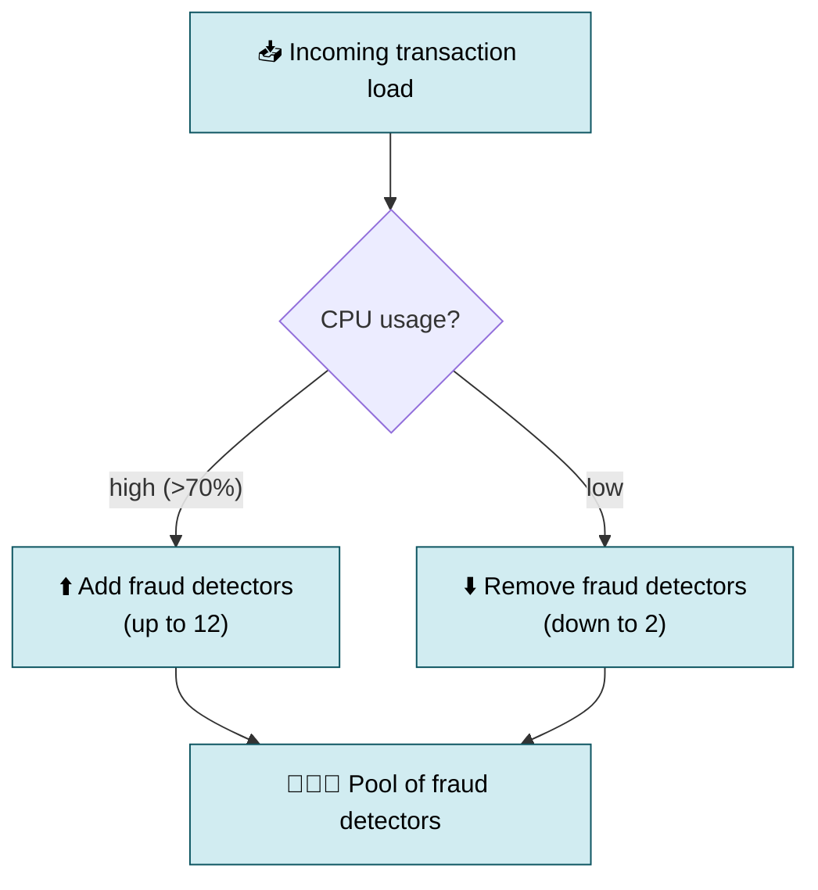

# Stream Sentinel, Explained in Plain Terms

This is the "explain it like I mean it" guide to how Stream Sentinel works. It
assumes no prior knowledge of streaming systems or machine learning, but it
doesn't skip the real details — every concept is named, every important file is
pointed to, and the actual numbers are here. If you read this top to bottom,
you'll understand not just *what* the system does but *why* each piece exists
and *how* they hand work to each other.

> **What is Stream Sentinel?** It watches a stream of credit-card-style
> transactions as they happen and decides, in about a third of a millisecond
> each, whether each one looks fraudulent. When something looks bad it raises an
> alarm, can automatically block the customer, and files the record away for
> analysis. It also keeps an eye on its own accuracy and can retrain and
> redeploy its decision model **without ever shutting down**.

---

## Table of contents

1. [The big idea: a conveyor belt, not a phone tree](#1-the-big-idea-a-conveyor-belt-not-a-phone-tree)
2. [Where the transactions come from (the producer)](#2-where-the-transactions-come-from-the-producer)
3. [The decision-maker (the fraud detector)](#3-the-decision-maker-the-fraud-detector)
4. [The brains behind the model (the ML subsystem)](#4-the-brains-behind-the-model-the-ml-subsystem)
5. [The model library and the deployment controls](#5-the-model-library-and-the-deployment-controls)
6. [How it watches its own health and retrains itself](#6-how-it-watches-its-own-health-and-retrains-itself)
7. [The plumbing that ties it together](#7-the-plumbing-that-ties-it-together)
8. [Testing and running it for real](#8-testing-and-running-it-for-real)
9. [The whole thing in one breath](#9-the-whole-thing-in-one-breath)
10. [Glossary](#glossary)

---

## 1. The big idea: a conveyor belt, not a phone tree

The whole system is organized around **Kafka**, which you can picture as a set
of conveyor belts in a factory. Each worker (component) picks up a piece of work
from one belt, does its job, and drops the result onto another belt. No worker
ever taps another on the shoulder and waits for an answer. They only ever talk
*through the belts*.

In Kafka's own vocabulary, a belt is called a **topic**, the workers reading
from it are **consumers**, and the workers putting things on it are
**producers**.

Why build it this way instead of having components call each other directly?

- **You can add more workers instantly.** The main input belt is split into 12
  parallel lanes (Kafka calls them **partitions**), so up to 12 copies of the
  fraud checker can run at once, each handling its own lane. Need more
  throughput? Add workers.
- **One slow part doesn't freeze the rest.** If the database is having a bad
  day, transactions keep getting scored — the results just queue up on a belt,
  waiting to be saved, instead of jamming the whole line.
- **Failure has a designated place to go.** Anything unprocessable is dropped
  onto a special "failure belt" rather than crashing the worker that found it.

Here's the entire system as belts and workers. Read it left to right, top to
bottom:



The dotted lines are the "something went wrong" paths. The solid lines are the
normal flow of work. Notice that **nothing points back to the producer** — work
only ever flows forward, which is what makes the whole thing easy to scale and
reason about.

> **A note on the names.** Throughout this doc, "belt" = Kafka topic, "worker" =
> a consumer/producer process, and the actual topic names are things like
> `synthetic-transactions`, `fraud-alerts`, `fraud-detection-results`,
> `blocked-transactions`, `model-drift-alerts`, `model-retraining-jobs`, and
> `dead-letter-queue`.

---

## 2. Where the transactions come from (the producer)

**File:** `src/producers/synthetic_transaction_producer.py` (class
`SyntheticTransactionProducer`)
**Settings:** `src/producers/config.py`

There's no real bank feed wired into this project, so the first worker on the
line *manufactures* transactions to test everything against. The trick is making
fake data that behaves like real fraud — otherwise the fraud detector would be
learning to catch patterns that don't exist in the wild.

It does three things to stay realistic:

**1. It copies the statistical fingerprint of a real dataset.** Each transaction
has about **200 fields**, matching the distributions of the well-known public
IEEE-CIS fraud dataset: amounts, card details, counts of how many cards and
addresses an account has touched, time gaps since the account's last activity,
and device/email signals. The real-world distributions are loaded from
`data/processed/ieee_cis_analysis.json`.

**2. Fraud is correlated, not random.** This is the most important detail. A
naive generator would flip a coin and label some transactions "fraud" at random.
Real fraud doesn't work that way — a fraudulent transaction tends to be
suspicious in *several ways at once*. So the generator first decides whether a
transaction is fraud based on genuine risk factors (`_determine_if_fraud` — odd
hour, unusual amount, rapid-fire spending), and then deliberately makes the
fraudulent ones *look* suspicious in a coordinated way
(`_apply_fraud_correlations` — a big amount **and** an unusual time **and** high
velocity, together). The baseline fraud rate is **2.71%** (`BASE_FRAUD_RATE`),
matching the real dataset.

**3. It remembers each customer.** An `entity_tracking` dictionary keeps the last
time it saw each fake customer, card, device, and email, so the "time since last
transaction" fields are internally consistent rather than nonsense.



Every knob lives in one file (`src/producers/config.py`): the fraud rate, how
much each risk factor matters, how often fields are left blank, the target speed
(`DEFAULT_TARGET_TPS = 2000`), the size of the customer pool
(`DEFAULT_USER_COUNT = 5000`). One worker can generate ~1,800 transactions per
second; four workers running together exceed 7,500 per second.

---

## 3. The decision-maker (the fraud detector)

**File:** `src/consumers/fraud_detector.py` (~2,300 lines, class `FraudDetector`)

This is the centerpiece. For each transaction it runs a short, fixed checklist
inside the `process_transaction` method. Here is that checklist as the
transaction experiences it:


Walking through the steps:

1. **Sanity-check the message** (`src/validation/transaction_validator.py`).
   Malformed transactions are thrown onto the failure belt *before* any work is
   wasted on them.
2. **Is this customer already blocked?** It checks a "blocked list" kept in
   **Redis** — an in-memory data store, essentially a very fast shared
   scratchpad. The check is a single `SISMEMBER blocked_users` operation. If the
   customer is blocked, the transaction skips scoring entirely and goes to the
   blocked belt. No point scoring someone you've already shut off.
3. **Pull up the customer's history** from Redis (their typical spending, recent
   activity) via `get_user_profile`.
4. **Build the feature list** (`extract_features`). It combines the raw
   transaction with computed signals: how fast this customer is spending
   ("velocity"), how risky this merchant type is, how far this amount is from
   their normal ("z-score" — how many standard deviations from typical),
   time-of-day patterns, and combinations of these.
5. **Score it** (see below).
6. **Feed the score to a drift watcher** (covered in [section 6](#6-how-it-watches-its-own-health-and-retrains-itself)).
7. **Act.** If the score crosses the alarm threshold (**0.3** by default, on a
   0-to-1 scale, tunable with `--threshold`), it drops an alarm on the
   `fraud-alerts` belt. Either way it records the full result on the
   `fraud-detection-results` belt.

### How the scoring works — and its safety net

The primary scorer is a trained **machine-learning model**. Specifically it's an
**XGBoost** model — a technique that combines hundreds of simple yes/no decision
trees into one strong predictor, where each new tree focuses on the mistakes of
the previous ones. In production it scores about **99.4% accurate** (measured by
"AUC", a 0-to-1 score of how well it separates fraud from non-fraud) across 200
features.

The genuinely clever part is the **safety net**. When the detector starts up
(`_load_ml_model`), it tries to get the model from two places, in order:


If *both* sources fail, the detector does **not** crash and does **not** go
blind. It flips into a **rules mode** using hand-written "if this looks off, add
to the suspicion score" logic (`_calculate_fraud_score`). An internal status
flag — `model_status` — always reads one of three values: `ml_primary` (using
the ML model), `rules_fallback` (using rules), or `loading`. There is never a
moment where transactions go unscored.

### Swapping the model without downtime

A background timer thread (`_model_refresh_loop`) wakes up **every 60 seconds**
and checks whether a newer model has been published to the library. If so, it
swaps it in mid-flight: transactions already being scored finish on the old
model; new ones use the new one. No restart, no dropped messages. A lock makes
sure a swap and a scoring never trip over each other.



### Running two models head-to-head (A/B testing)

When you want to test a new model against the current one on *real* traffic, the
detector splits customers into two groups. It does this with a hashing trick
(`ab_test_manager.assign_variant`): it scrambles the customer's ID into a number
(using MD5) and uses that number to assign the group. Because the same ID always
scrambles to the same number, a given customer always lands in the same group —
their experience stays consistent. The "control" group is scored by the current
model; the "treatment" group by the candidate. The system tallies which catches
more fraud, then runs a standard statistics test (a **two-proportion z-test** — a
textbook way to check whether the gap between two rates is real or just luck)
before declaring a winner.

### Two speeds

- **Single mode** (default): one transaction at a time. Simple and predictable.
- **Batch mode** (`--batch`): gathers a handful of transactions and scores them
  in one shot, which is more efficient per transaction. A **flow controller**
  watches how far behind the system is and automatically shrinks the batch if
  processing starts lagging, so it never bites off more than it can chew. The
  batch path commits its progress only after the whole batch finishes, which
  keeps the bookkeeping exactly correct even if a single message in the batch
  fails.

### Why it's fast

The heavy number-crunching is offloaded to a small **C++ component** (a compiled,
low-level language that's far faster than Python for math-heavy work). Python
hands off the calculation through `FastInferenceEngine`
(`src/inference/fast_inference.py`) and gets the answer back in about **0.15
milliseconds**. End to end — validation, history lookup, feature building,
scoring, publishing — a transaction takes roughly **0.32 milliseconds**, which
works out to about **3,100 transactions per second per worker**.

The model is converted into the format the C++ piece reads by
`src/inference/export_model.py`, and the C++ source lives in
`src/inference/cpp/`. Importantly, **if the C++ piece isn't built, the system
silently falls back to pure Python** — slower, but fully working. You never *have*
to compile anything to run the project.

### The other workers on the line

| Worker | File | What it does |
|---|---|---|
| **Alarm handler** | `alert_processor.py` | Reads fraud alarms, classifies severity (CRITICAL ≥ 0.9 down to LOW), decides the response (block now, investigate, human review…), and blocks customers by adding them to the Redis blocked list with a 24-hour expiry. Tracks response-time targets (CRITICAL within 1 second). |
| **Saver** | `persistence_consumer.py` | Writes results to two databases: **everything** to ClickHouse (built for fast analytics over huge volumes) and only the **meaningful alerts** to PostgreSQL (the official record). Saves in batches for speed. |
| **Failure handler** | `dlq_consumer.py` | Reads the failure belt ("DLQ" = *dead letter queue*) and logs each failed message with its full error and original contents so a human can investigate. |
| **Enhanced detector** | `enhanced_fraud_detector.py` | An alternate version of the fraud detector that wires the full online-learning stack in directly, for experiments. |

> **Why two databases?** PostgreSQL is the trustworthy system of record — good
> for "show me this specific alert and its audit trail." ClickHouse is built for
> sweeping analytical questions over billions of rows — "what was our fraud rate
> by hour last month?" Using each for what it's best at is why the saver writes
> to both.

---

## 4. The brains behind the model (the ML subsystem)

**Directory:** `src/ml/`

### One feature recipe, used twice

A subtle but critical detail: the *exact same code*
(`src/ml/features/feature_engineer.py`, class `FeatureEngineer`) computes the
signals both when **training** the model and when **scoring live transactions**.

Why this matters: if the training code computed "velocity" one way and the live
code computed it slightly differently, the model would behave differently in the
lab than in production — a notoriously painful bug called **train/serve skew**.
Sharing one module makes it impossible. The same class has a
`compute_batch_features` method (for training, working on a whole table of data)
and a `compute_streaming_features` method (for one live transaction at a time),
both using identical logic underneath.

### Training the model

**File:** `src/ml/training/core/pipeline_orchestrator.py` (class
`PipelineOrchestrator`)

Training runs as a series of stages, like a pipeline:



Two things are worth calling out:

**It tunes itself.** Rather than a human hand-picking the model's settings, it
uses a library called **Optuna** to automatically try dozens of configurations
(around 75 trials) and keep the best one. Each trial is checkpointed the moment
it finishes, so a crash mid-search doesn't throw away completed work.

**It's tuned to catch fraud, even at the cost of some false alarms.** The model
is optimized for an **F2-score with cost-sensitive learning** rather than raw
accuracy. In plain terms: missing a real fraud is far more expensive than
occasionally flagging a legitimate transaction, so the training deliberately
rewards *catching more fraud* (recall) more than it rewards *avoiding false
alarms* (precision). The "cost-sensitive" part means it weights the rare fraud
examples much more heavily during training (roughly 36×), because fraud is only
2.71% of the data and would otherwise be drowned out.

The whole pipeline is also **resumable** — if a long training run crashes, a
checkpoint manager lets it pick up where it left off instead of starting over.

---

## 5. The model library and the deployment controls

**File:** `src/ml/online_learning/model_registry.py` (class `ModelRegistry`)

The **model registry** is a versioned library of models stored in Redis (with a
backup copy on disk). Think of it like a package registry, but for trained
models. It:

- tracks which version is currently **live** in production,
- refuses to promote a model that fails a minimum-accuracy bar,
- can **roll back** to a previous version if a new one misbehaves.

`scripts/deploy_model.py` is the command-line control panel for it:

```bash
python scripts/deploy_model.py register --model-path models/new.pkl --version 2.0.0
python scripts/deploy_model.py promote  --version 2.0.0 --strategy canary
python scripts/deploy_model.py rollback --version 1.0.0
python scripts/deploy_model.py ab-test  --control 1.0.0 --treatment 2.0.0
python scripts/deploy_model.py status
```



Because the detector re-checks the library every 60 seconds (the hot-swap from
[section 3](#3-the-decision-maker-the-fraud-detector)), **every one of these
commands takes effect without restarting anything.** "Canary" promotion means
rolling the new model out gradually rather than all at once, so you can watch for
trouble before committing fully.

---

## 6. How it watches its own health and retrains itself

This is the self-correcting loop, and it's the most sophisticated part of the
system. The danger it guards against is called **drift**: over time, the incoming
traffic can change so much that the model's assumptions no longer hold —
fraudsters change tactics, customer behavior shifts, a new product launches. A
model that was excellent six months ago can quietly become useless.

Here's how the system catches that and fixes itself:



The pieces:

- **Drift watcher** (`src/ml/online_learning/live_drift_monitor.py`). It measures
  drift with **PSI** (Population Stability Index) — a single number summarizing
  how much the distribution of fraud scores has shifted compared to a baseline.
  Above **0.15** is treated as a meaningful warning. It checks periodically (every
  N transactions, default 1,000) rather than on every single one. When it trips,
  it drops a "things look stale" message on the `model-drift-alerts` belt.

- **Retraining trigger** (`src/ml/online_learning/retraining_trigger.py`). It
  listens for those staleness messages but does **not** react blindly. It
  enforces three guardrails first:
  1. **Enough data** — at least 5,000 confirmed-outcome examples to learn from.
  2. **Cooldown** — no more than one retrain every 6 hours, so a noisy signal
     can't trigger a retraining storm.
  3. **Severity** — the drift has to be bad enough to be worth it.

  Only when all three pass does it kick off a retraining job.

- **Quality gate.** A freshly retrained model has to **beat the current one by a
  clear margin** (a measurable AUC improvement) before it's allowed to go live.
  If it doesn't, it's rejected and the old model stays.

So the full cycle is: model gets stale → drift alarm → guardrails → retrain →
quality check → publish → detector hot-swaps it within 60 seconds. It's hands-off,
but with brakes at every step so it can't do something reckless on its own.

---

## 7. The plumbing that ties it together

These are the supporting utilities. None of them is the star of the show, but the
system wouldn't be production-grade without them.

| Part | File | What it actually does |
|---|---|---|
| **Belt settings** | `kafka/config.py` | One place defining all the conveyor-belt settings, with separate profiles for laptop / staging / production. |
| **Failure packaging** | `kafka/dlq.py` | The helper that wraps a failed message (what broke, where, the full error trace, the original message) and sends it to the failure belt. |
| **Strict format checking** | `kafka/schema_utils.py` | Optional rigid message-format validation (Avro / Schema Registry); if the checker isn't running, it falls back to plain JSON. |
| **Backpressure** | `kafka/lag_monitor.py` | Watches whether workers are falling behind and tells batch mode to slow down. |
| **Databases** | `persistence/` | PostgreSQL code (official record, audit logs) and ClickHouse code (analytics). |
| **Live metrics** | `monitoring/metrics.py` | Publishes live numbers (transactions/sec, score distribution, latency, which model is active) for dashboards to read. |
| **Health checks** | `monitoring/health.py` | Simple "are you alive?" (`/health`) and "are you ready for traffic?" (`/health/ready`) web endpoints that Kubernetes pings. |
| **Request tracing** | `tracing/correlation.py` | Stamps each transaction with a tracking ID that rides along through every belt, so you can trace one transaction's entire journey end to end. |
| **Structured logs** | `utils/logging.py` | Makes every log line a structured record (with the transaction ID, customer ID, correlation ID) instead of loose text, so logs are searchable. |

### How observability fits together

Each worker publishes its live numbers on its own dedicated port. **Prometheus**
(a metrics collector) scrapes those ports on a schedule, and **Grafana** (a
dashboard tool) charts them.



The port assignments are fixed: fraud detector **8000**, alarm handler **8001**,
saver **8002**, enhanced detector **8003**, failure handler **8004**.

---

## 8. Testing and running it for real

### Testing

The tests in `tests/` are organized in layers, from smallest to most realistic:



The **chaos** layer is the interesting one: it deliberately breaks dependencies
(kills Redis, corrupts the model file, floods Kafka) to confirm the system
degrades *gracefully* — that the safety nets described above actually fire.
`tests/run_tests.py` runs the whole suite and even spins up the services the
tests need first.

### Running it locally

Local development uses **Docker** (`docker/`) — one command brings up Kafka,
Redis, both databases, and the monitoring dashboards as containers on your
machine:

```bash
docker compose -f docker/docker-compose.yml up -d
```

### Running it in production

Production uses **Kubernetes** (`k8s/`), the industry-standard system for running
containers across a fleet of servers. The headline feature is **autoscaling**: it
keeps a minimum of **2** fraud-detector copies running and automatically spins up
to **12** when CPU gets busy (above 70%), then scales back down when traffic
calms.



**Helm** (`helm/stream-sentinel/`) is the templating tool that makes all those
settings — image versions, database endpoints, replica counts, the fraud
threshold — configurable from a single `values.yaml` file instead of editing
dozens of manifests by hand. The container image itself is built from
`docker/Dockerfile.consumer`, which compiles the fast C++ component during the
build and runs as a non-root user for security.

---

## 9. The whole thing in one breath

> **Fake-but-realistic transactions ride conveyor belts (Kafka) to a fraud
> checker that scores each one in about a third of a millisecond using a
> machine-learning model — with a rules-based safety net if the model is ever
> missing. Customer history and the blocked list live in a fast in-memory store
> (Redis). Alarms get triaged and can auto-block customers; everything is saved
> to two databases and charted on live dashboards. Meanwhile the system watches
> its own accuracy, and when it drifts, it retrains, quality-checks, and
> hot-swaps in a new model within a minute — no downtime — while autoscaling
> itself up and down on Kubernetes as traffic demands.**

The single most important architectural choice is the conveyor belt itself. Once
you accept that every component only ever reads from a belt and writes to a belt,
everything else follows naturally: you scale by adding workers, you survive
failures by letting work queue, and you can swap out any piece — even the brain
of the system, the model — without stopping the line.

---

## Glossary

| Term | Plain meaning |
|---|---|
| **Kafka** | The set of "conveyor belts" all components communicate through. |
| **Topic** | One conveyor belt (a named stream of messages). |
| **Producer / Consumer** | A worker that puts work on a belt / takes work off a belt. |
| **Partition** | A parallel lane within one belt, enabling multiple workers. |
| **Redis** | A very fast in-memory store used for customer history and the blocked list. |
| **XGBoost** | The machine-learning model — many small decision trees combined into one strong predictor. |
| **Feature** | One input signal the model looks at (amount, velocity, time-of-day, etc.). |
| **AUC** | A 0-to-1 score of how well the model separates fraud from non-fraud (~0.994 here). |
| **F2-score** | An accuracy measure that rewards catching fraud (recall) more than avoiding false alarms. |
| **Drift / PSI** | How much incoming traffic has changed from the baseline; PSI is the number that measures it. |
| **DLQ** | Dead letter queue — the "failure belt" where unprocessable messages go. |
| **Hot-swap** | Replacing the live model without restarting or dropping transactions. |
| **A/B test** | Running two models on different customer groups to compare them on real traffic. |
| **Prometheus / Grafana** | Tools that collect live metrics and chart them on dashboards. |
| **Kubernetes / Helm** | The system that runs the containers in production / the tool that configures it. |

---

*For the AI-assistant-oriented quick reference, see [`CLAUDE.md`](../CLAUDE.md).
For the original architecture summary, see [`README.md`](../README.md). For
deeper dives on individual subsystems, see the topic guides under
[`docs/`](README.md).*
